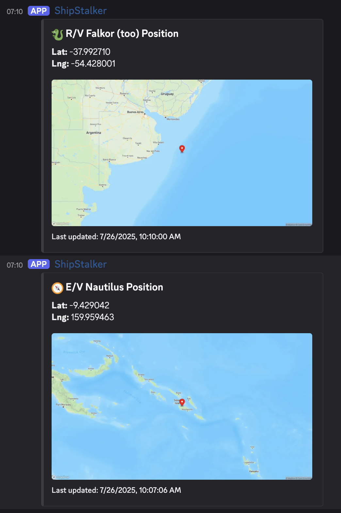

  

## ShipStalker
A simple Discord bot to display the positions of research vessels as a static MapBox image.  Uses publicly available APIs and MapBox to build a map image showing the vessels position.

  
  
What it looks like in Discord

#### Current Vehicle List:
- R/V Falkor (too) --> Schmidt Ocean Institute
- E/V Nautilus --> Ocean Exploration Trust
- NOAA Ship Okeanos Explorer --> NOAA
...hopefully more to come.

#### Command List
- `!help` --> show list of available commands
- `!everyship` --> shortcut for calling all of individual ship commands
- `!falkor` --> show R/V Falkor's position
- `!nautilus` --> show E/V Nautilus's postion
- `!okeanos` --> show NOAA Ship Okeanos Explorer's postion
